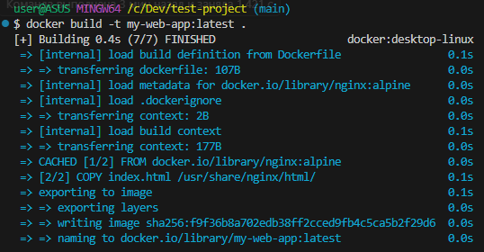
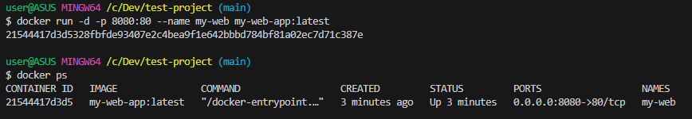
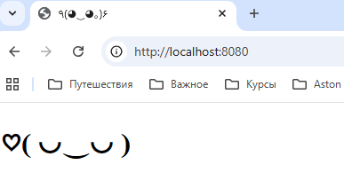

### Задание A1: "Собери и запусти" (Docker, Linux, CLI)
1. Директория `test-project` создана.

2. Dockerfile создан:
```
test-project/Dockerfile
```

3. Сборка образа:



4. Запуск контейнера:



5. Cтраница в браузере:



6. docker-compose.yml файл:
```
test-project/docker-compose.yml
```


