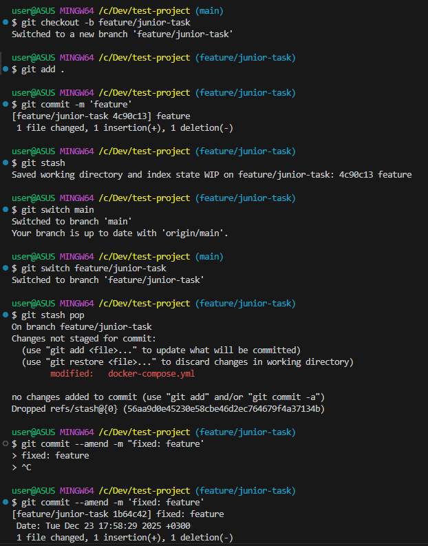

### Задание A1: "Собери и запусти" (Docker, Linux, CLI)
1. Директория `test-project` создана.

2. Dockerfile создан:
```
test-project/Dockerfile
```

3. Сборка образа:


4. Запуск контейнера:


5. Cтраница в браузере:


6. docker-compose.yml файл:
```
test-project/docker-compose.yml
```

7. Чтобы доставить index.html в контейнер без пересборки образа, можно использовать docker volumes. Как это прописано в docker-compose.yml:
```
    volumes:
      - ./index.html:/usr/share/nginx/html/index.html
```

### Задание B1: "Простой скрипт-помощник"

test-project/simple_script.py

### Задание B2: "Маленькая проблема в Git" (Git)



### Задание B3: "Объясни концепцию" (Понимание CI/CD)

Как это было реализовано на проекте где я работал. Проект находится в GitLab, использовался GitLab раннер.  
В зависимости от ветки различались стейджи, если разработчик делает фичу в отдельной ветке то для этой ветки отрабатывало только два стейджа, линтеры и тестирование.  
После того как разработчик делает MR в основную ветку тогда пайплан проходится полностью в нашем случае это было 4 шага, линтеры, тестирование, билд и деплой.  
По второму вопросу, там перечисляются такие шаги:
- запуск тестов
- сборка образа
- пуш образа в Docker Hub
- уведомление в Telegram об успехе/провале  

В нашем проекте шаг 'запуск тестов' это по сути наши 2 первых шага линтеры и тестирование.  
Шаг 'сборка образа' это шаг билд как правило.  
Шаг 'пуш образа в Docker Hub', в нашем случае образы пушились на сервер яндекс клауд, происходило это на этапе билда и было спрятано подключаемом шаблоне, насколько помню канико.  
Шаг 'уведомление в Telegram об успехе/провале', этого функционала у нас к сожалению не было, но его легко можно было добавить как отдельным стейджем так и отдельной джобой внутри стейджа.
